<!--
  meta-description: Curated list of the best workforce planning software platforms and open-source tools for headcount planning, scenario modeling, organizational design, skills and capacity forecasting, and labor cost planning.
  keywords: workforce planning, headcount planning, scenario modeling, organizational design, workforce analytics, labor cost planning, people analytics, capacity forecasting, HR planning, FP&A, workforce scheduling
-->
# Awesome-Workforce-Planning-Platform

  

## 📊 Top Workforce Planning Platforms Ecosystem

**📋 Curated List of SaaS Products & Open-Source GitHub Projects**

*🧭 Focused on Headcount Planning, Scenario Modeling, Org Design, Skills & Capacity Forecasting, Labor Cost Planning & Strategic Workforce Analytics*

**🕒 Last updated: August 2026**

🚀 This repository tracks notable **SaaS platforms** and **open-source projects** for **Workforce Planning**. These tools help organizations forecast headcount, model future org structures, align talent supply with demand, run what-if scenarios, manage labor costs, and connect people planning with financial and operational plans.

**🔑 Key topics:** headcount planning, scenario modeling, organizational design, workforce analytics, labor cost planning, capacity forecasting, skills forecasting, workforce scheduling, workforce optimization, strategic workforce planning, people analytics, HR planning, and FP&A integration.

**🏆 Examples** include Anaplan, Workday Adaptive Planning, Visier, Orgvue, ChartHop, One Model, SAP SuccessFactors Workforce Planning, PeopleFluent, IBM Planning Analytics, Board, Pigment, HiBob Workforce Planning, and Peakon Planning (the category leaders).

**🛠️ Open-source emphasis**: This section is heavily expanded with every major active project for workforce allocation, rostering/optimization, organizational modeling, headcount forecasting agents, and open HR cores that can support planning workflows — ideal for HR, finance, and people-analytics teams seeking transparency and customization.

🤝 Contributions welcome! Open a PR to add/update entries. Keep descriptions factual and link to official sites.

## Table of Contents

- [🏢 SaaS/Hosted Platforms](#saas-products)

- [🛠️ Open-Source GitHub Projects](#open-source-github-projects)

- [❓ FAQ](#faq)

- [🤝 How to Contribute](#how-to-contribute)

- [⚠️ Disclaimer](#disclaimer)

## 🏢 SaaS/Hosted Platforms

| Product | Description | Pricing (starting tier) | Free tier / trial | Company size (revenue / valuation) |
| --- | --- | --- | --- | --- |
| **[🏢 SAP SuccessFactors Workforce Planning / SAP Workforce Planning](https://www.sap.com/)** | Enterprise workforce planning capabilities within the SAP SuccessFactors and broader SAP planning ecosystem. | Module-based custom pricing: ~$6–$38/user/month depending on bundle; Workforce Analytics module ~$3,770/yr | 30-day free trial of SuccessFactors HCM (guided tours, no setup) | ~$255B market cap (Aug 2026); €34.2B revenue (FY2024) |
| **[🖥️ IBM Planning Analytics](https://www.ibm.com/)** | Enterprise planning and analytics platform (TM1-based) used for workforce, financial, and operational scenario modeling. | Essentials ~$825/month for 5 users (~$165/user/month); Cloud Standard ~$1,650/month for 10 users | 30-day free trial | ~$221B market cap (Aug 2026); $62.8B revenue (FY2024) |
| **[📈 Workday Adaptive Planning](https://www.workday.com/)** | Cloud planning solution tightly integrated with Workday HCM for headcount forecasting, workforce budgeting, and finance-HR alignment. | Custom quote; entry-level ~$50K/yr (20-user pack lists at ~$135K/yr; typical deals $94K–$108K/yr) | 30-day free trial (full access, no obligation) | ~$49B market cap (2026); $9.55B revenue (FY2026) |
| **[🧩 Anaplan / Anaplan Workforce Planning](https://www.anaplan.com/)** | Enterprise connected-planning platform widely used for workforce cost forecasting, headcount modeling, and integration of people plans with finance and operations. | Custom quote; entry-level from ~$20K–$50K/yr, typical enterprise deals $150K–$1M+/yr | No commercial free tier — 90-day free workspace via the Anaplan Talent Builder learning program; free demo | $10.7B acquisition by Thoma Bravo (2022); >$1B ARR (2024) |
| **[💼 HiBob Workforce Planning](https://www.hibob.com/)** | Workforce planning features within the HiBob people platform for growing and mid-sized organizations. | ~$16–$25/employee/month (custom quote; lower at higher volumes) | No self-serve free trial — 30-min guided demo | ~$2.45B valuation (Series D, 2022) |
| **[🔍 Visier / Visier People Planning](https://www.visier.com/)** | People-analytics and workforce-planning platform focused on insights, predictive scenarios, and data-driven talent decisions. | Custom per-employee pricing; annual contracts ~$50K–$300K+ | 30-day free trial (sandbox with admin privileges and sample data) | ~$1B+ valuation (2021); ~$147M ARR (2024 est.) |
| **[🎨 Pigment](https://www.pigment.com/)** | Modern business planning platform with flexible modeling that includes workforce and headcount planning use cases. | Custom quote; entry-level ~$30K–$50K/yr (typical mid-market licensing $75K–$200K/yr) | No self-service free trial — demo/POC on request | ~$1B valuation (Series D, 2024) |
| **[🗣️ Peakon Planning (Workday)](https://www.workday.com/)** | Planning and people-insights capabilities associated with the Peakon engagement platform under the Workday umbrella. | From ~$20K/yr (Workday Peakon Employee Voice; per-employee pricing under Workday contracts) | No free tier — demo only | $700M acquisition by Workday (2021) |
| **[📋 Board](https://www.board.com/)** | Intelligent planning and decision-making platform supporting workforce, financial, and integrated business planning. | Custom quote; ~$1,250/user/yr basic license (est.), enterprise subscriptions from ~$80K/yr | No free trial — demo only | ~$500M est. valuation; ~$177M revenue (est.) |
| **[🗺️ ChartHop](https://www.charthop.com/)** | People operations platform with visual org charts, headcount planning, compensation, and workforce insights for mid-market and growing companies. | $8/employee/month for the first module, $4/employee/month per additional module; $9,000/yr minimum (Core from $5/employee/month) | 14-day free trial of ChartHop Basic | ~$260M valuation (Series C, 2023) |
| **[🌊 PeopleFluent](https://www.peoplefluent.com/)** | Talent management and workforce planning solutions covering succession, skills, and organizational planning. | From $20,000/yr (annual subscription); Org Charting module ~$50/user/month | Free trial on request | $150M acquisition by LTG (2018) |
| **[🌐 Orgvue](https://www.orgvue.com/)** | Organizational design and workforce transformation platform strong in scenario modeling, structure visualization, and future-state planning. | Custom quote; estimated ~$30K–$150K+/yr for a mid-sized company | No free trial — free demo / free 2-hour advisory workshop only | ~$53M ARR (2024 est.) |
| **[📐 One Model](https://www.onemodel.co/)** | People-analytics and workforce-planning platform that unifies HR data for advanced reporting and planning use cases. | Custom quote (data-volume based); annual contracts estimated $30K–$150K | No public free tier — demo/POC on request | ~$18M ARR (2023 est.) |

*Pricing figures are the lowest publicly reported starting tiers as of August 2026; most enterprise vendors price per deployment and require a quote. Company-size figures use the most recently reported market cap (public companies), VC valuation/acquisition value (private companies), or estimated ARR where no valuation is public; rows are sorted by that figure, descending.*

## 🛠️ Open-Source GitHub Projects

*⭐ Sorted by GitHub stars (descending) as of August 2026; each star badge links to that repo's stargazers page.*

- **[🏗️ Odoo HR](https://github.com/odoo/odoo)**   

  Mature open-source ERP with an HR core that provides employee data, org structure, and attendance foundations for custom planning layers.

- **[📦 ERPNext](https://github.com/frappe/erpnext)**   

  Open-source ERP with an HRMS module providing employee data, org structure, and analytics foundations for custom planning layers.

- **[🧮 OR-Tools](https://github.com/google/or-tools)**   

  Google's open optimization library used to solve complex capacity, skill-mix, and roster constraints in workforce planning.

- **[📊 Grist](https://github.com/gristlabs/grist-core)**   

  Open-source relational spreadsheet-database that can serve as a flexible scenario-modeling layer for headcount, attrition, and promotion planning.

- **[🧑‍💼 Frappe HR](https://github.com/frappe/hrms)**   

  Open-source HR and people-operations app on the Frappe framework covering employee records, leaves, and workforce data.

- **[⏱️ Kimai](https://github.com/kimai/kimai)**   

  Open-source time-tracking with hourly cost rates and team budgets — useful for labor-cost visibility in workforce planning.

- **[🌳 OrgChart](https://github.com/dabeng/OrgChart)**   

  Open-source JavaScript org-chart library for visualizing and extending organization structures with headcount attributes.

- **[⚙️ Timefold](https://github.com/TimefoldAI/timefold-solver)**   

  Open-source AI constraint solver (successor to OptaPlanner) for shift scheduling, rostering, and resource allocation.

- **[👥 OrangeHRM](https://github.com/orangehrm/orangehrm)**   

  Mature open-source HR management system with employee data, org structure, and absence tracking that can support planning workflows.

- **[🤖 MintHCM](https://github.com/minthcm/minthcm)**   

  Open-source AI-native HCM platform with organizational structure management, competences, and extensible HR processes that can support planning workflows.

- **[🏖️ Jorani](https://github.com/jorani/jorani)**   

  Open-source leave and absence management system that tracks workforce availability and supports HR planning workflows.

- **[🧪 OptaPy](https://github.com/optapy/optapy)**   

  Open-source Python constraint solver for shift scheduling and rostering problems, built on the Timefold/OptaPlanner engine.

- **[🐍 pyworkforce](https://github.com/rodrigo-arenas/pyworkforce)**   

  Practical open-source Python library for workforce planning: queue staffing, multi-skill staffing, shift scheduling, rostering, and break optimization.

- **[📅 MASTERPLAN](https://github.com/schorschii/masterplan)**   

  Web-based open-source workforce management and duty-roster system with automatic scheduling and self-service features.

- **[🗓️ Workforce Planner (allocation tool)](https://github.com/Iwan1212/workforce-planner)**   

  Open-source visual timeline tool for IT and project-based companies to plan employee allocation, detect overbooking, and manage capacity.

- **[🧭 Workforce-Compass](https://github.com/i-richardwang/Workforce-Compass)**   

  Interactive Streamlit application for multi-year organizational talent structure forecasting and scenario planning.

- **[🧠 Workforce Planning Agent](https://github.com/mujeeb-k/workforce-planning-agent)**   

  Open-source agent that turns headcount targets and budgets into costed move / reskill / hire action plans and executive briefings.

### ➕ Additional Strong Open-Source Options

- 🧬 Org-as-code and organizational-design frameworks (YAML/JSON org schemas, templates, and governance models).

- 📉 Custom headcount & scenario models — community Python/Streamlit or spreadsheet-replacement tools for attrition, promotion, and recruitment scenario modeling.

- 🏭 Frepple and other open planning engines (primarily supply-chain oriented but adaptable to capacity thinking).

- 🗄️ Open BI and data-modeling stacks (dbt + Metabase/Superset) built on HRIS extracts for planning dashboards.

- 🧠 Skills ontologies and open talent-graph projects that feed strategic workforce planning.

- 🌳 Simple org-chart generators and hierarchy visualizers that can be extended with headcount attributes.

- 🤖 Local LLM agents that assist with scenario narrative generation and plan explanation.

**🧰 Frameworks for building custom systems**: Ingest HRIS data into an open warehouse, use **pyworkforce** or constraint solvers for operational staffing, layer **Workforce-Compass** or custom Streamlit/Python models for multi-year structural forecasts, store scenarios in versioned tables, and present interactive plans via open BI tools. Extend **MintHCM**, **Odoo**, or **ERPNext** with custom planning modules. Combine with open skills data and local LLMs for gap analysis and action recommendations.

## ❓ FAQ

**What is workforce planning software?**

Workforce planning software helps HR, finance, and operations teams forecast headcount needs, model future organizational structures, align talent supply with demand, run what-if scenarios, and manage labor costs. Leading workforce planning platforms include Anaplan, Workday Adaptive Planning, Visier, Orgvue, ChartHop, One Model, SAP SuccessFactors Workforce Planning, IBM Planning Analytics, Board, Pigment, and HiBob.

**What are the best open-source workforce planning tools?**

Popular open-source options include pyworkforce, Workforce-Compass, MASTERPLAN, MintHCM, and the workforce-planning-agent. For rostering and scheduling optimization, OR-Tools, Timefold, and OptaPy solve capacity, skill-mix, and shift-planning constraints, while Odoo HR, ERPNext, Frappe HR, and OrangeHRM provide open HR cores that can support custom planning layers.

**Is there free workforce planning software?**

Yes. Most commercial platforms — Workday Adaptive Planning, Visier, IBM Planning Analytics, ChartHop, and SAP SuccessFactors — offer 14-day or 30-day free trials, and every open-source project listed above is free to self-host and customize.

**How much does workforce planning software cost?**

Enterprise platforms are mostly custom-priced. Entry-level contracts start at roughly $20K–$50K per year for Anaplan, Pigment, and PeopleFluent; ChartHop starts at $8 per employee per month; IBM Planning Analytics at about $825/month for 5 users; and HiBob at ~$16–$25 per employee per month. Open-source tools are free but require implementation effort.

**How do I choose a workforce planning platform?**

Consider your organization size, budget, existing HRIS and finance stack, and whether you need enterprise-grade governance and security (commercial platforms) or transparency and customization (open-source projects). The SaaS table above compares starting prices, free-tier limits, and company size, while the open-source list compares GitHub popularity.

## 🤝 How to Contribute

1. 🍴 Fork the repo.

2. ✏️ Add/edit entries in `README.md` (follow existing format).

3. 📝 Include: name, link, 1–2 sentence description, and whether it's SaaS or open-source.

4. 🚀 Submit PR with a short explanation.

⭐ Star the repo if you find it useful!

## ⚠️ Disclaimer

- ⚠️ This is a **community-curated** list — not exhaustive and not an endorsement.

- 🔐 Workforce planning involves sensitive people data and high-stakes organizational decisions. Open-source tools are excellent for modeling, prototyping, and internal analytics but typically lack the governance, audit, security, and enterprise integration features of mature commercial platforms.

- ⚖️ Always ensure compliance with employment law, data-protection regulations, and internal change-management processes when acting on planning outputs.

---

**🌟 Made for HR leaders, people analytics teams, finance partners, and organizations seeking more transparent workforce planning.**

💡 Let's make headcount and organizational planning more open, scenario-driven, and data-informed.

## ⭐ Star History

